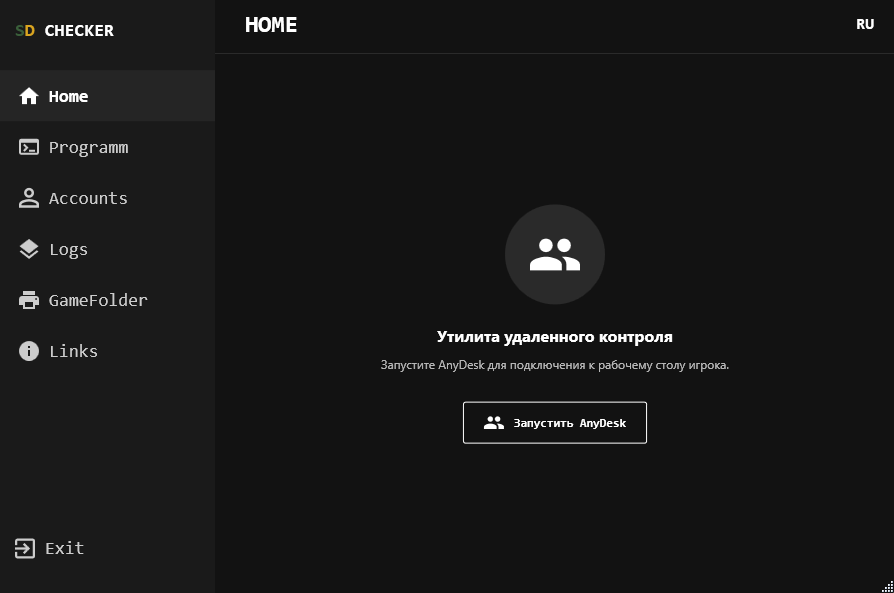
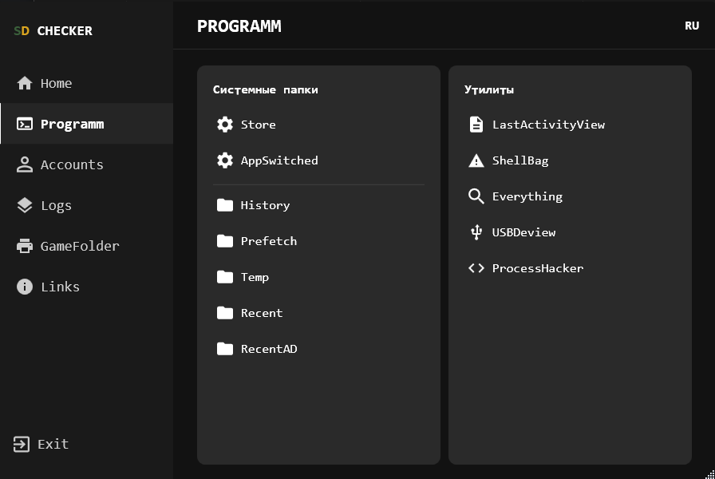
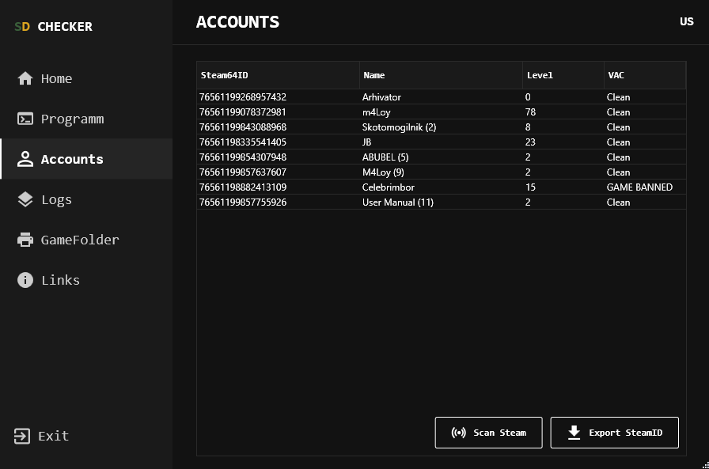

# SD Checker


[English](#english) | [Русский](#русский)

---

## Preview / Предпросмотр

<p align="center">
  
  
</p>
<p align="center">
  
  
</p>

---

<a name="english"></a>
## English

SD Checker is a remote control and game server administration utility designed for community owners and moderators. The tool combines diagnostic tools for player PCs, Steam account monitoring, and server resource management.

### Key Features

* **Multi-language Support:** Instant UI switching between Russian and English (RU/US).
* **Steam Monitoring:** Asynchronous scanning of local accounts fetching nicknames, levels, and VAC statuses via the official Steam Web API.
* **Game Path Scanner:** Automatic detection of all installed Steam games across all connected drives using VDF manifest parsing.
* **System Utilities:** Quick access to hidden system folders (History, Prefetch, Temp, Recent) and registry keys (Store, AppSwitched).
* **Portable Tools:** Integration with AnyDesk, Everything, ProcessHacker, USB Deview, Shellbag, and LastActivityView.
* **Modern UI:** Custom Dark Mode borderless interface with vector icons and smooth navigation.
* **White-labeling (Customization):** Easy adaptation for your community via an external `settings.json` file.

### Tech Stack

* **Programming Language:** C# 12
* **Platform:** .NET 10.0 (Self-Contained Single File)
* **GUI:** WPF (Custom Dark Theme)
* **Integrations:** Steam Web API, VDF Manifest Parser, JSON Configuration

### Installation and Launch

1. Download the latest release (`SD_Checker_vX.X.zip`) from the **Releases** page.
2. Unpack the archive to any convenient folder on your PC.
3. **Important:** Ensure the `Tools` folder is located in the same directory as the executable `.exe` file.
4. Run the `.exe` file (compiled as Self-Contained Single File, so installing .NET Runtime on the target PC is not required).

---

<a name="русский"></a>
## Русский

SD Checker: утилита удаленного контроля и администрирования игровых серверов, разработанная для модераторов и владельцев сообществ. Программа объединяет в себе инструменты для быстрой диагностики ПК игрока, мониторинга Steam-аккаунтов и управления серверными ресурсами.

### Основные возможности

* **Мультиязычность:** Мгновенное переключение интерфейса между русским и английским языками (RU/US).
* **Мониторинг Steam:** Асинхронное сканирование локальных аккаунтов с подгрузкой ников, уровней и VAC-статусов через официальный Steam Web API.
* **Сканер путей игр:** Автоматический поиск всех установленных игр Steam на любых дисках через парсинг файлов манифестов VDF.
* **Системные утилиты:** Быстрый доступ к скрытым системным папкам (History, Prefetch, Temp, Recent) и веткам реестра (Store, AppSwitched).
* **Портативные инструменты:** Интеграция с AnyDesk, Everything, ProcessHacker, USB Deview, Shellbag и LastActivityView.
* **Современный UI:** Кастомный Dark Mode интерфейс без стандартных рамок Windows, векторные иконки и плавная навигация.
* **White-labeling (Кастомизация):** Легкая адаптация программы под свое сообщество через внешний файл `settings.json`.

### Технологический стек

* **Язык программирования:** C# 12
* **Платформа:** .NET 10.0 (Self-Contained Single File)
* **Графический интерфейс:** WPF (Custom Dark Theme)
* **Интеграции:** Steam Web API, VDF Manifest Parser, JSON Configuration

### Установка и запуск

1. Скачайте последний релиз (`SD_Checker_vX.X.zip`) со страницы **Releases**.
2. Распакуйте архив в удобную папку на ПК.
3. **Важно:** Убедитесь, что папка `Tools` находится в той же директории, что и исполняемый файл `.exe`.
4. Запустите `.exe` файл (программа скомпилирована как Self-Contained Single File, поэтому предварительная установка .NET Runtime на целевой ПК не требуется).

---

## Configuration / Настройка (settings.json)

To ensure Steam scanning works correctly and to customize parameters, edit the `settings.json` file in the root folder of the application:

```json
{
  "SteamApiKey": "YOUR_STEAM_API_KEY_HERE",
  "Links": {
    "Discord": "[https://discord.gg/yourserver](https://discord.gg/yourserver)",
    "Website": "[https://your-website.com](https://your-website.com)",
    "Twitch": "[https://twitch.tv/yourchannel](https://twitch.tv/yourchannel)",
    "Rules": "[https://your-rules-link.com](https://your-rules-link.com)"
  }
}